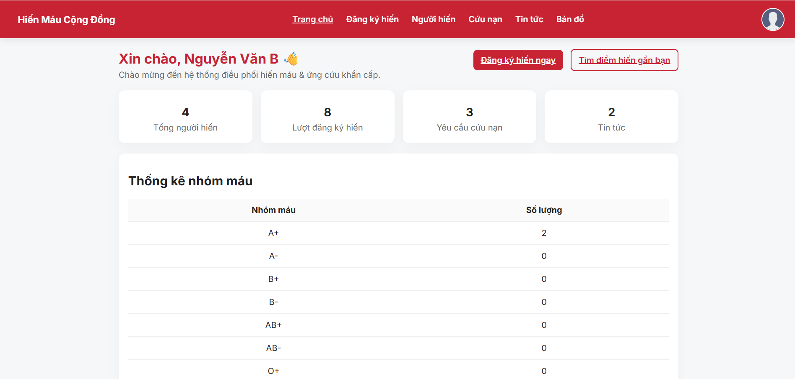
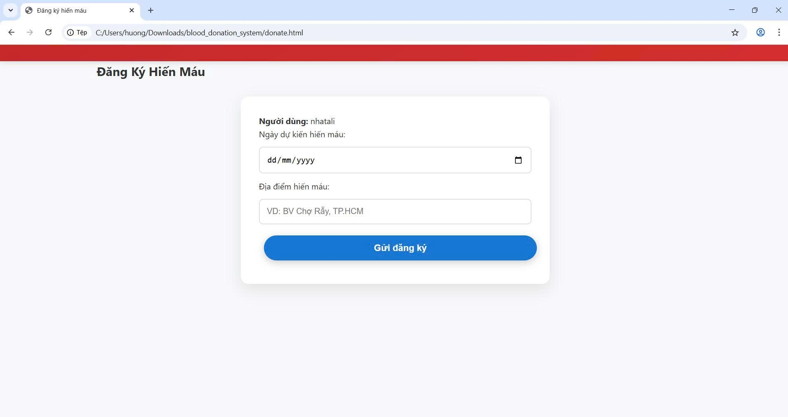
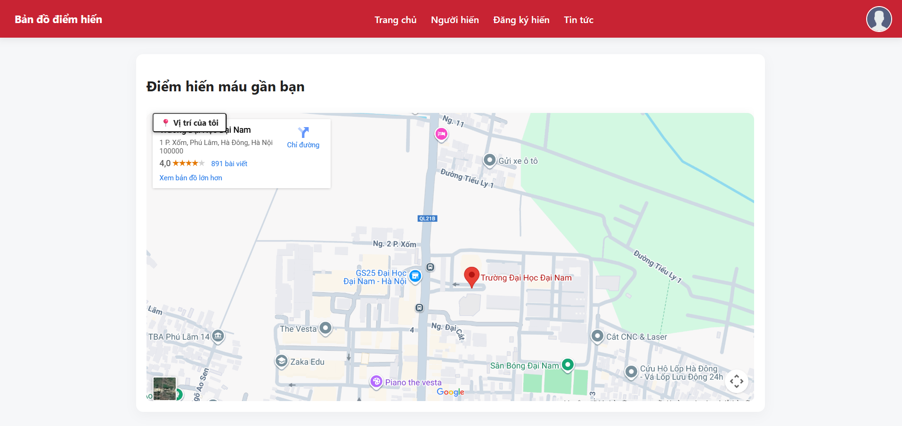
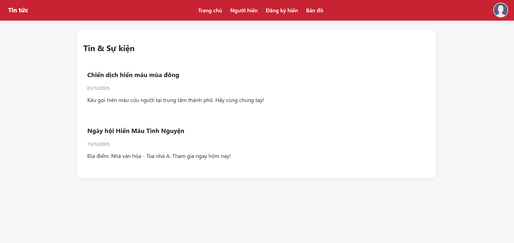
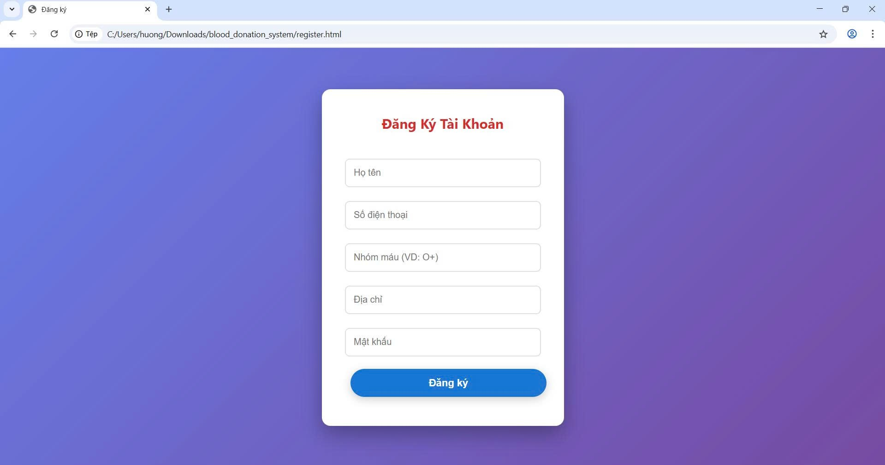
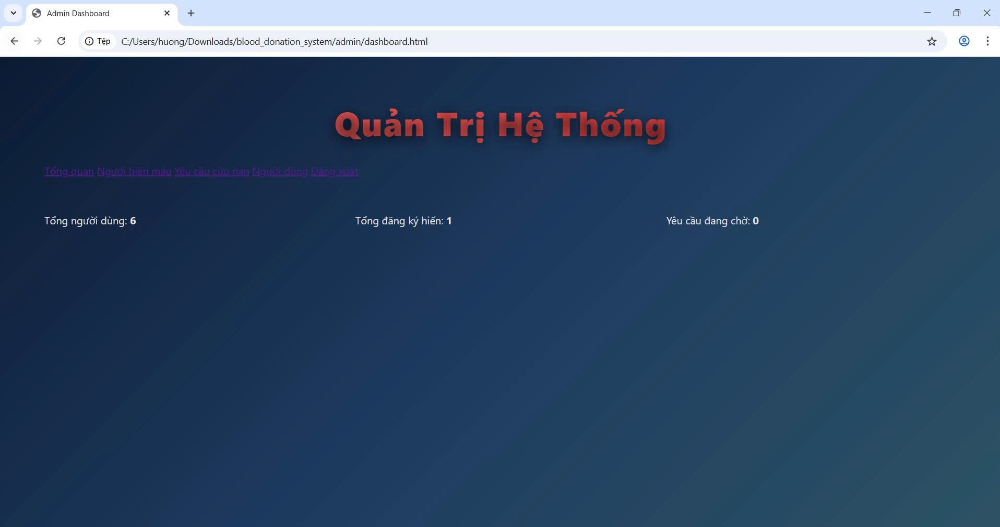
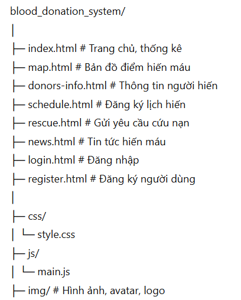

<h2 align="center">
    <a href="https://dainam.edu.vn/vi/khoa-cong-nghe-thong-tin">
    🎓 Faculty of Information Technology (DaiNam University)
    </a>
</h2>
<h2 align="center">
   HỆ THỐNG ĐIỀU PHỐI HIẾN MÁU VÀ CỨU NẠN KHẨN CẤP DỰA TRÊN NỀN TẢNG DỮ LIỆU VÀ ĐỊNH VỊ SỐ
</h2>

    

        
        
        
    

## 📖 1. Giới thiệu
Hệ thống điều phối hiến máu và cứu nạn khẩn cấp dựa trên nền tảng dữ liệu và định vị số là một ứng dụng web cho phép:

- Người dùng đăng ký hiến máu, tìm các điểm hiến máu gần vị trí thực của bản thân.  
- Người nhận cứu nạn khẩn cấp gửi yêu cầu cứu trợ với thông tin chính xác và thời gian thực.  
- Quản trị hệ thống theo dõi số liệu hiến máu, người đăng ký, lịch hiến và các tình huống khẩn cấp.  
- Hiển thị bản đồ trực quan các điểm hiến máu, cứu nạn và các chương trình hiến máu đang diễn ra.  

Hệ thống giúp **tối ưu hóa việc điều phối máu và cứu trợ**, giảm thiểu thời gian phản hồi và cải thiện hiệu quả cứu người.

---

## 🔧 2. Ngôn ngữ lập trình sử dụng

- HTML, CSS, JavaScript:  
  - Thiết kế giao diện web trực quan, responsive.  
  - Quản lý dữ liệu tạm thời bằng LocalStorage.  
  - Thêm các chức năng tương tác như bản đồ, thông báo, bảng thống kê.  

- Có thể mở rộng sử dụng **API định vị (Google Maps / Leaflet)** để xác định vị trí người dùng và điểm hiến máu gần nhất.

---

## 🚀 3. Các chức năng chính

- **Đăng ký và đăng nhập người hiến máu**  
  - Lưu thông tin cá nhân, nhóm máu và lịch hiến.  

- **Đăng ký cứu nạn khẩn cấp**  
  - Gửi yêu cầu cứu trợ với thông tin chi tiết, được lưu trong hệ thống.  

- **Bản đồ địa điểm hiến máu và cứu nạn**  
  - Hiển thị các điểm hiến máu gần vị trí thực của người dùng.  
  - Cho phép click vào marker để xem thông tin chi tiết.  

- **Tin tức chương trình hiến máu**  
  - Hiển thị danh sách các chiến dịch hiến máu đang diễn ra.  

- **Thống kê dữ liệu**  
  - Tổng số người hiến theo nhóm máu O, A, B, AB.  
  - Số yêu cầu cứu nạn và lịch hiến đã đăng ký.  

- **Quản lý thông tin người dùng**  
  - Chỉnh sửa thông tin cá nhân, đổi mật khẩu, đăng xuất.  

---

## 🖼️ 4. Hình ảnh minh họa giao diện

- **Trang chủ / Dashboard**  

- **Đăng ký hiến máu / Lịch hiến**  

- **Bản đồ điểm hiến máu gần bạn**  

- **Tin tức hiến máu**  

- **Thông tin cứu nạn khẩn cấp**  

- **Chatbot**

- **Dự đoán khả năng hiến máu**

---

## 🚀 5. Các bước cài đặt và sử dụng

### 5.1 Yêu cầu
- Trình duyệt web hiện đại (Chrome, Firefox, Edge).  
- Không yêu cầu server phức tạp (dùng LocalStorage lưu dữ liệu).  
- Nếu muốn mở rộng: cài đặt web server (Apache, Node.js) để lưu dữ liệu thật.  

### 5.2 Cấu trúc dự án

### 5.3 Chạy hệ thống
1. Mở **index.html** trên trình duyệt.  
2. Người dùng mới đăng ký qua **register.html**.  
3. Đăng nhập bằng email và mật khẩu.  
4. Truy cập các tính năng:  
   - `Lịch hiến` → đăng ký lịch hiến máu.  
   - `Bản đồ` → xem điểm hiến máu gần bạn.  
   - `Tin tức` → xem chiến dịch hiến máu.  
   - `Cứu nạn` → gửi yêu cầu cứu nạn khẩn cấp.  

---

## 📝 License

Họ tên: Nguyễn Chí Nhật

MSV: 1671020231

Lớp: CNTT 16-03

© 2025 AIoTLab, Faculty of Information Technology, DaiNam University. All rights reserved.

---