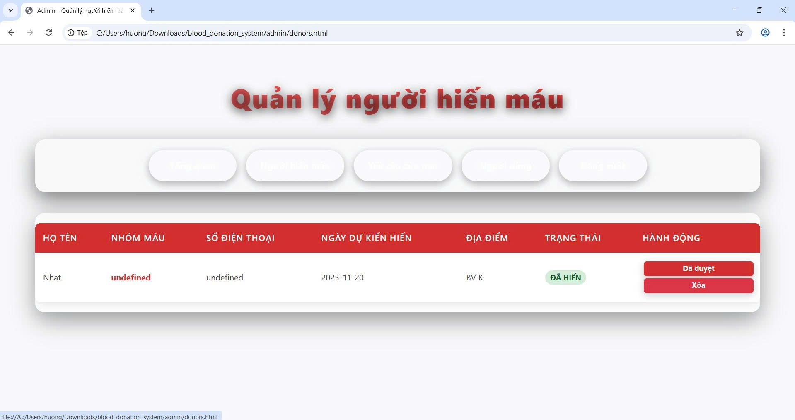
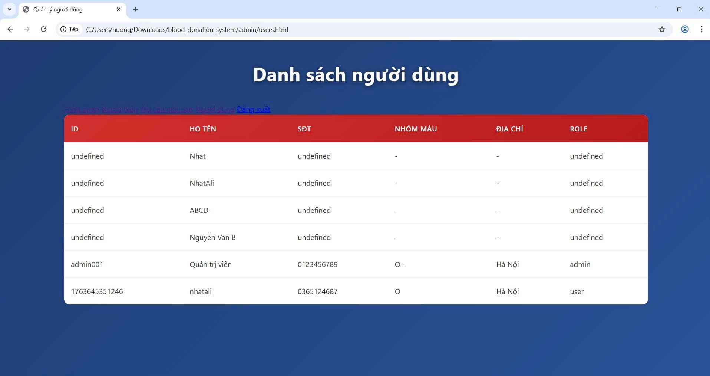
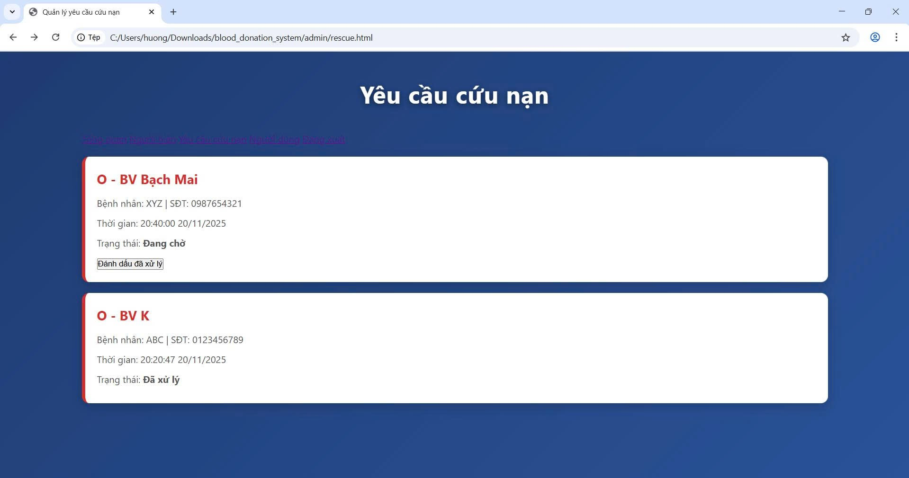
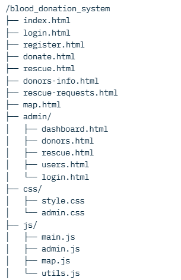

<h2 align="center">
    <a href="https://dainam.edu.vn/vi/khoa-cong-nghe-thong-tin">
    🎓 Faculty of Information Technology (DaiNam University)
    </a>
</h2>
<h2 align="center">
   HỆ THỐNG ĐIỀU PHỐI HIẾN MÁU VÀ CỨU NẠN KHẨN CẤP DỰA TRÊN NỀN TẢNG DỮ LIỆU VÀ ĐỊNH VỊ SỐ
</h2>

    

        
        
        
    

## 📖 1. Giới thiệu
Hệ thống điều phối hiến máu và cứu nạn khẩn cấp là một ứng dụng web hoàn chỉnh giúp kết nối nhanh chóng giữa:
- Người sẵn sàng hiến máu tình nguyện  
- Người bệnh cần máu khẩn cấp  
- Quản trị viên hệ thống (Admin)

Ứng dụng sử dụng **định vị GPS thời gian thực** và **bản đồ tương tác** (Leaflet + OpenStreetMap) để:
- Tự động xác định vị trí người dùng
- Hiển thị **5 bệnh viện gần nhất** kèm khoảng cách chính xác (km)
- Đánh dấu vị trí người hiến máu và các yêu cầu cứu nạn đang chờ xử lý
- Rút ngắn tối đa thời gian điều phối máu trong tình huống cấp cứu

---

## 🔧 2. Ngôn ngữ lập trình sử dụng

| Công nghệ                  | Mục đích sử dụng                                                                 |
|----------------------------|-----------------------------------------------------------------------------------|
| HTML5 + CSS3 + JavaScript  | Xây dựng giao diện responsive, hiện đại, hoạt động mượt trên mọi thiết bị       |
| **Leaflet.js + OpenStreetMap** | Bản đồ tương tác, định vị GPS, tính khoảng cách, hiển thị marker động          |
| **LocalStorage**           | Lưu trữ toàn bộ dữ liệu người dùng, lịch hiến máu, yêu cầu cứu nạn (không cần server) |
| **Font Awesome 6**         | Hệ thống icon đẹp, nhất quán                                                      |
| **Glassmorphism + Gradient** | Giao diện Admin và trang người dùng cực kỳ hiện đại, chuyên nghiệp             |

→ Dễ dàng mở rộng lên backend (Node.js + MongoDB/Firebase) khi triển khai thực tế.

---

## 🚀 3. Các chức năng chính

| Chức năng                                | Mô tả chi tiết                                                                                 |
|------------------------------------------|-------------------------------------------------------------------------------------------------|
| Đăng ký / Đăng nhập người dùng           | Dùng số điện thoại + mật khẩu, lưu nhóm máu, địa chỉ                                           |
| Đăng ký hiến máu                         | Chọn ngày, địa điểm → tự động hiển thị trên bản đồ                                             |
| Gửi yêu cầu cứu nạn khẩn cấp             | Nhập thông tin bệnh nhân, nhóm máu cần → hiện ngay marker nhấp nháy trên bản đồ                |
| **Bản đồ tương tác + Định vị GPS**       | Nhấn nút “Vị trí” → định vị tức thì → hiển thị 5 bệnh viện gần nhất + khoảng cách + vòng 5km   |
| Tìm người hiến máu                       | Xem danh sách + vị trí trên bản đồ theo nhóm máu                                               |
| Trang quản trị Admin                     | Dashboard thống kê realtime, quản lý người dùng, yêu cầu cứu nạn, lịch hiến máu                 |
| Thống kê trực quan                       | Tổng người hiến, yêu cầu đang chờ, mạng sống được cứu                                          |
| Thông báo Toast đẹp                      | Hiển thị thành công/lỗi kiểu hiện đại                                                          |
| Responsive 100%                          | Hoạt động hoàn hảo trên điện thoại, máy tính bảng, PC                                          |

---

## 🖼️ 4. Hình ảnh minh họa giao diện

- **Trang chủ / Dashboard**  

- **Đăng ký hiến máu / Lịch hiến**  

- **Yêu cầu cứu nạn khẩn cấp**  

- **Danh sách người sẵn sàng hiến máu**

- **Đăng ký tài khoản**

- **Đăng nhập tài khoản**

- **Trang chủ Admin**

- **Quản lý người hiến máu**

- **Danh sách người dùng**

- **Danh sách yêu cầu cứu nạn**

---

## 🚀 5. Các bước cài đặt và sử dụng

### 5.1 Yêu cầu
- Chỉ cần trình duyệt web hiện đại (Chrome, Edge, Firefox)
- Không cần cài đặt server, phần mềm nào

### 5.2 Cấu trúc dự án

### 5.3 Các bước chạy dự án
1. Giải nén toàn bộ thư mục dự án  
2. Mở file `index.html` bằng trình duyệt (khuyên dùng **Live Server** trong VS Code để bản đồ chạy mượt nhất)  
3. Đăng ký tài khoản mới → Đăng nhập  
4. Trải nghiệm các chức năng:
   - `Hiến máu ngay` → đăng ký hiến máu
   - `Cần máu gấp!` → gửi yêu cầu cứu nạn
   - `Bản đồ` → nhấn nút "Vị trí" để xem bệnh viện gần bạn nhất
   - Chatbot góc dưới → hỏi gì cũng trả lời!
   - Admin: dùng SĐT `0123456789` + mật khẩu `admin123` → vào `admin/login.html`

---

## 📝 License

Họ tên: Nguyễn Chí Nhật & Cao Văn Huy & Đào Đức Mạnh

MSV: 1671020231 & 1671020135 & 1671020198

Email: chinhatff@gmail.com

Lớp: CNTT 16-03

© 2025 AIoTLab, Faculty of Information Technology, DaiNam University. All rights reserved.

---